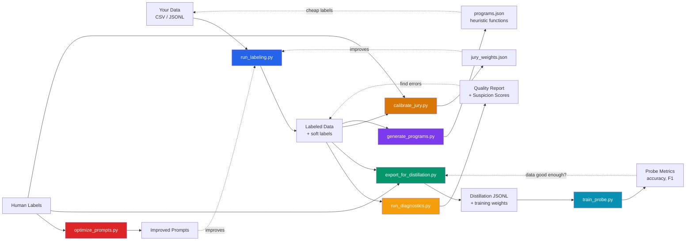
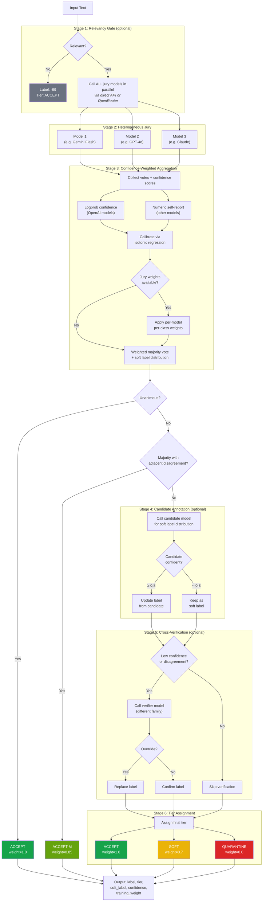
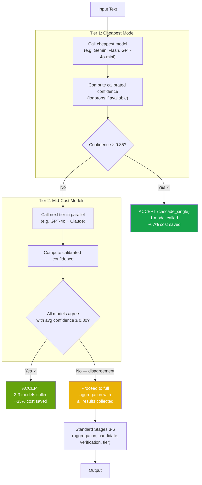
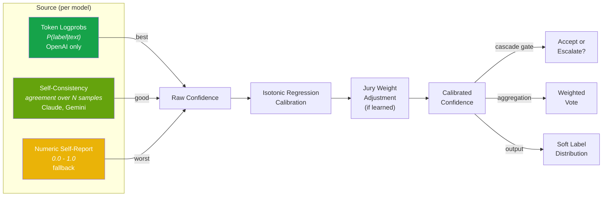
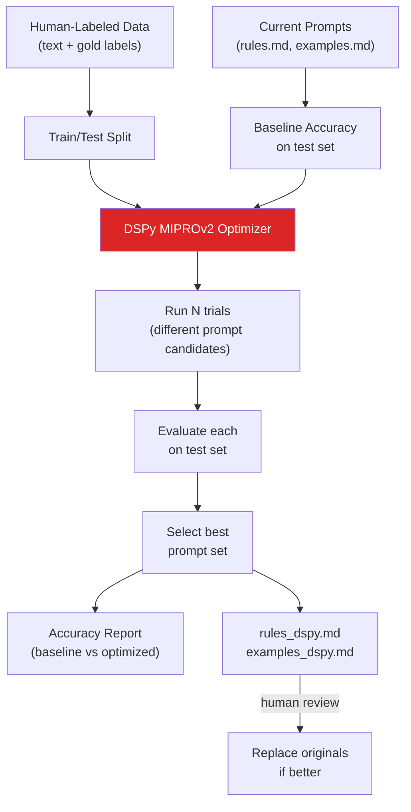
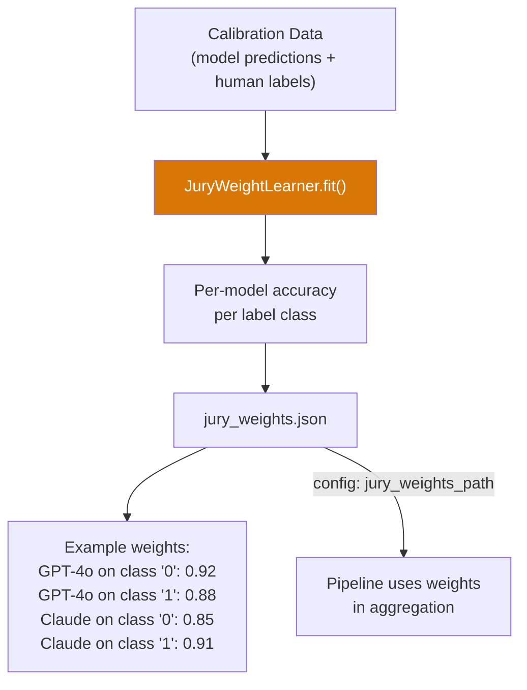
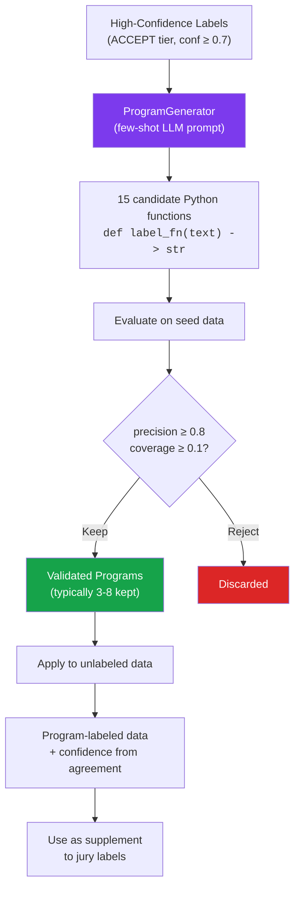
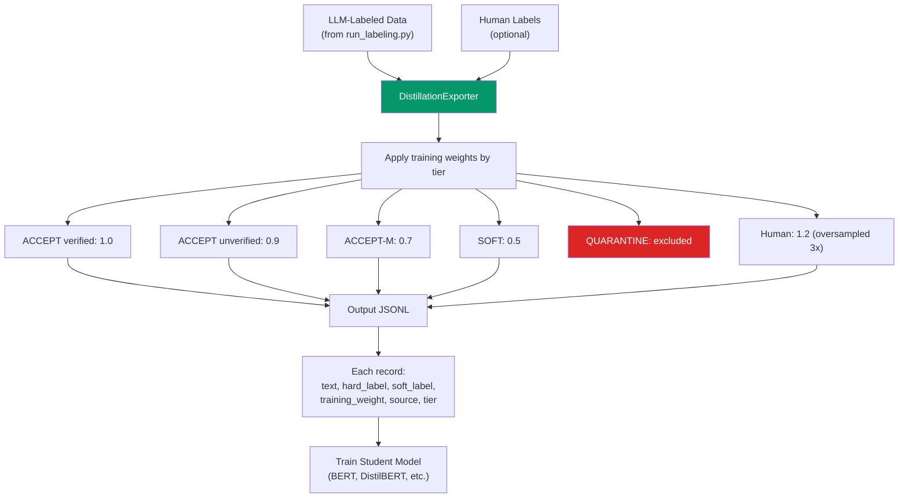
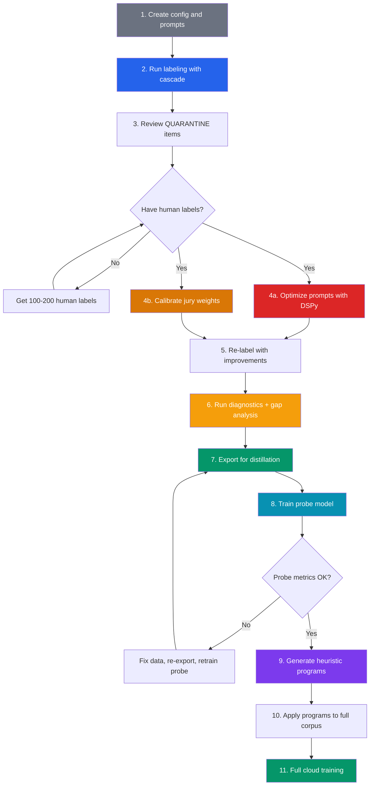

# Sibyls

*Named after the ancient prophetesses who gave independent oracles — like multiple LLM models rendering independent judgments.*

A production-ready LLM-powered data labeling service. Heterogeneous jury voting, cascaded model escalation, confidence calibration, and dataset-agnostic architecture — all grounded in peer-reviewed research from 2024-2026.

## Quick Start

```bash
# Install
pip install -e .

# Option A: Use OpenRouter (one key for all models)
export OPENROUTER_API_KEY="..."

# Option B: Use providers directly
export OPENAI_API_KEY="..."
export ANTHROPIC_API_KEY="..."
export GOOGLE_API_KEY="..."

# Label data
python scripts/run_labeling.py \
    --dataset fed_headlines \
    --input datasets/fed_data.csv \
    --output outputs/labeled.csv
```

---

## System Overview

Eight scripts, one pipeline, any dataset:



| Script | Purpose | When to Use |
|--------|---------|-------------|
| `run_labeling.py` | Label data through multi-model jury pipeline | Always — this is the main entry point |
| `run_diagnostics.py` | Post-hoc error detection and quality analysis | After labeling, to find suspicious samples |
| `train_probe.py` | Fine-tune a local RoBERTa for fast evaluation | To measure training-data quality before cloud training |
| `export_for_distillation.py` | Export with training weights + human mixing | To train a student model on the labeled data |
| `optimize_prompts.py` | Improve prompts using DSPy + human labels | When you have ground-truth labels and want better accuracy |
| `calibrate_jury.py` | Learn per-model, per-class reliability weights | After initial labeling, to improve aggregation |
| `generate_programs.py` | Create cheap heuristic labeling functions | To scale up: label large unlabeled corpora cheaply |
| `run_lit.py` | Launch LIT browser UI for model interpretability | To visually inspect a distilled or probe model |

---

## Core Labeling Pipeline

The pipeline has two modes: **full jury** (all models in parallel) and **cascade** (cheapest model first, escalate only when uncertain).

### Full Jury Mode (default)



### Cascade Mode (`use_cascade: true`)

Saves 40-60% API cost by not calling expensive models on easy items.



**How cost_tier works:**
```
cost_tier: 1  →  Called first (cheapest: Gemini Flash, GPT-4o-mini)
cost_tier: 2  →  Called only if tier 1 is uncertain (GPT-4o, Claude)
cost_tier: 3  →  Called only if tiers 1+2 disagree (expensive models)
```

---

## Confidence Scoring

The cascade and aggregation decisions depend on confidence. Here's where it comes from, ranked by reliability:



| Source | ECE | When Available | Notes |
|--------|-----|----------------|-------|
| Logprobs | ~0.05 after calibration | OpenAI models (`has_logprobs: true`) | Best — actual model internals |
| Self-consistency | ~0.10 | Any model (costs N extra calls) | Good — empirical agreement |
| Numeric self-report | 0.13-0.43 | Always (structured output) | Worst — LLMs are overconfident |

---

## Prompt Optimization (DSPy)

When you have human-labeled data, DSPy can automatically improve your prompts:



```bash
python scripts/optimize_prompts.py \
    --dataset fed_headlines \
    --labeled-data datasets/human_labeled.csv \
    --text-column headline \
    --label-column label_hawk_dove \
    --write-prompts
```

---

## Jury Weight Calibration

After initial labeling, learn which models are reliable for which label classes:



```bash
python scripts/calibrate_jury.py \
    --dataset fed_headlines \
    --calibration-data datasets/human_labeled.csv \
    --model-columns gpt4_label claude_label gemini_label \
    --true-label-column human_label \
    --output outputs/fed_headlines/jury_weights.json
```

---

## ALCHEmist Program Generation

Generate cheap Python heuristic functions from high-confidence labels:



```bash
# Generate
python scripts/generate_programs.py \
    --config configs/fed_headlines.yaml \
    --seed-data outputs/fed_headlines/labeled.csv \
    --output outputs/fed_headlines/programs.json

# Apply to new data
python scripts/generate_programs.py \
    --config configs/fed_headlines.yaml \
    --load-programs outputs/fed_headlines/programs.json \
    --apply-to datasets/unlabeled.csv \
    --output outputs/fed_headlines/program_labeled.csv
```

---

## Distillation Export

Export labeled data optimized for training a student model:



```bash
python scripts/export_for_distillation.py \
    --llm-labels outputs/fed_headlines/labeled.csv \
    --human-labels datasets/human_labeled.csv \
    --human-text-column headline \
    --human-label-column label \
    --output outputs/fed_headlines/distillation.jsonl
```

---

## Post-Labeling Diagnostics

After labeling, run diagnostics to find potential errors without ground truth:

```bash
# Full diagnostics on pipeline output
python scripts/run_diagnostics.py \
    --dataset fed_headlines \
    --labeled-data outputs/fed_headlines/labeled.csv \
    --output outputs/fed_headlines/diagnostics/

# Human-labeled data with custom columns
python scripts/run_diagnostics.py \
    --dataset fed_headlines \
    --labeled-data datasets/fedspeak/human_labeled.csv \
    --output outputs/fed_headlines/diagnostics_human/ \
    --text-column headline --label-column hawk_dove \
    --enable embedding,distribution,nli,report
```

Diagnostics modules (mix and match via `--enable`):

| Module | What it detects | Requires |
|--------|----------------|----------|
| `embedding` | Intra-class outliers, centroid violations, cluster fragmentation, near-duplicates | Embedding provider |
| `distribution` | Class imbalance, length bias, label co-occurrence anomalies | Text + labels |
| `nli` | Label-text semantic mismatches (e.g. dovish text labeled hawkish) | `hypotheses.yaml` |
| `batch` | Temporal drift across batches, cascade-tier bias | Pipeline output (jury columns) |
| `rationale` | Reasoning inconsistencies between models | Pipeline output (reasoning column) |
| `report` | Aggregated Markdown + JSON quality report with recommendations | Any of the above |
| `gap_analysis` | LLM-powered error clustering and synthetic data generation | Embeddings + suspicion scores |

Outputs are written to the output directory: `suspicion_scores.csv`, `top_suspects.csv`, `quality_report.md`, `quality_report.json`, and UMAP visualisation HTML.

See [docs/diagnostics.md](docs/diagnostics.md) for the full guide.

---

## Gap Analysis

Gap analysis identifies *systematic* weaknesses in your training data — not just individual errors, but patterns of errors grouped by topic.

```bash
# Enable via config (diagnostics.gap_analysis.enabled: true) or force it:
python scripts/run_diagnostics.py \
    --dataset fed_headlines \
    --labeled-data outputs/fed_headlines/labeled.csv \
    --output outputs/fed_headlines/diagnostics/ \
    --enable embedding,report,gap_analysis \
    --force-gap-analysis
```

The gap analyzer:
1. Pulls the highest-suspicion samples into an error pool.
2. Clusters them by topic using UMAP + HDBSCAN on cached embeddings.
3. Computes TF-IDF topic labels and label distributions per cluster.
4. Sends each cluster to an LLM for diagnosis: what's ambiguous, what the correct labels likely are, and what augmentation strategy would help.
5. Optionally generates synthetic training examples per gap.

Outputs: `gap_report.md`, `gap_report.json`, `synthetic_examples.csv`.

See [docs/gap-analysis.md](docs/gap-analysis.md) for details and configuration.

---

## Probe Model (Local Fine-Tuning)

Train a lightweight RoBERTa classifier locally to get fast feedback on training-data quality before committing to the full cloud training pipeline:

```bash
# Train on distillation JSONL
python scripts/train_probe.py \
    --dataset fed_headlines \
    --training-data outputs/fed_headlines/distillation.jsonl

# Override hyperparams
python scripts/train_probe.py \
    --dataset fed_headlines \
    --training-data outputs/fed_headlines/distillation.jsonl \
    --model distilroberta-base --epochs 3 --batch-size 64

# Evaluate a saved model on new data
python scripts/train_probe.py \
    --dataset fed_headlines --eval-only \
    --model-dir outputs/fed_headlines/probe \
    --training-data outputs/fed_headlines/distillation_v2.jsonl
```

Requires the optional `probe` dependency group: `pip install 'sibyls[probe]'`

The probe uses per-sample training weights from the distillation export, so high-quality labels (ACCEPT tier, human-verified) influence the model more than uncertain ones. Metrics come from the same `EvaluationService` used elsewhere, so probe results are directly comparable to cloud model evaluations.

See [docs/probe-model.md](docs/probe-model.md) for the full iteration workflow.

---

## LIT (Language Interpretability Tool)

Visually inspect a distilled or probe model's predictions using Google's LIT:

```bash
pip install 'sibyls[lit]'

python scripts/run_lit.py \
    --config configs/fed_headlines.yaml \
    --loader my_loader.py \
    --checkpoint outputs/fed_headlines/probe \
    --data outputs/fed_headlines/labeled.csv
```

Opens a browser UI with per-example predictions, attention maps, saliency maps, and embedding projections alongside jury reference labels. See `scripts/run_lit.py --help` for full options.

---

## Recommended Workflow

The full end-to-end workflow for a new labeling project:



See [docs/iteration-workflow.md](docs/iteration-workflow.md) for a detailed walkthrough.

---

## Configuration

Each dataset is configured via a YAML file in `configs/`:

```yaml
# configs/my_dataset.yaml
name: my_dataset
labels: ["0", "1", "2"]
text_column: text

# Pipeline stages (toggle on/off)
use_relevancy_gate: false
use_candidate_annotation: true
use_cross_verification: false
use_structured_output: true
use_cascade: false

# Jury models (ordered by cost_tier for cascade)
jury_models:
  - provider: google
    model: gemini-2.5-flash
    name: Gemini-Flash
    cost_tier: 1            # cheapest, called first in cascade
  - provider: openai
    model: gpt-4o
    name: GPT-4o
    has_logprobs: true
    cost_tier: 2
  - provider: anthropic
    model: claude-sonnet-4-5-20250929
    name: Claude
    cost_tier: 2

# Cascade thresholds
cascade_confidence_threshold: 0.85  # single model accept
cascade_agreement_threshold: 0.80   # two model accept

# Verification (Stage 5)
verification_model:
  provider: google
  model: gemini-2.5-pro
  name: Verifier
verification_threshold: 0.6

# Resource limits
budget_per_model: 10.0
batch_size: 10
```

### Using OpenRouter (Recommended for Simplicity)

[OpenRouter](https://openrouter.ai/) gives you access to models from OpenAI, Anthropic, Google, Meta, Mistral, and others through a single API key. Set `provider: openrouter` and use the OpenRouter model identifier:

```yaml
jury_models:
  - provider: openrouter
    model: google/gemini-2.5-flash
    name: Gemini-Flash
    cost_tier: 1
  - provider: openrouter
    model: openai/gpt-4o
    name: GPT-4o
    cost_tier: 2
  - provider: openrouter
    model: anthropic/claude-sonnet-4
    name: Claude
    cost_tier: 2

# Only need one API key
# export OPENROUTER_API_KEY="..."
```

The OpenRouter provider includes built-in rate limiting, cost tracking, and budget enforcement. You can also mix providers — e.g., use OpenAI directly (for logprobs) and OpenRouter for the rest:

```yaml
jury_models:
  - provider: openrouter
    model: google/gemini-2.5-flash
    name: Gemini-Flash
    cost_tier: 1
  - provider: openai          # direct for logprobs
    model: gpt-4o
    name: GPT-4o
    has_logprobs: true
    cost_tier: 2
  - provider: openrouter
    model: anthropic/claude-sonnet-4
    name: Claude
    cost_tier: 2
```

Prompts live in `prompts/{dataset_name}/`. The `prompts/example/` directory is a fully documented template:

```
prompts/example/
├── system.md          # Role and domain expertise (fill in [DOMAIN], [TEXT_TYPE])
├── rules.md           # Classification rules with examples (fill in label definitions)
├── examples.md        # Calibration examples per label (replace with your examples)
├── mistakes.md        # Common errors to avoid (replace with task-specific mistakes)
├── hypotheses.yaml    # NLI hypothesis strings per label (for diagnostic scoring)
├── candidate.md       # Disagreement resolution prompt (generic, usually no changes needed)
├── verify.md          # Cross-verification prompt (generic, usually no changes needed)
└── program_gen.md     # ALCHEmist program generation prompt (generic)
```

### Supported Providers

| Provider | Config name | API Key Env Var | Logprobs | Notes |
|----------|-------------|-----------------|----------|-------|
| **OpenAI** | `openai` | `OPENAI_API_KEY` | Yes | Best for logprob-based confidence |
| **Anthropic** | `anthropic` | `ANTHROPIC_API_KEY` | No | Use self-consistency for confidence |
| **Google** | `google` | `GOOGLE_API_KEY` | No | Use self-consistency for confidence |
| **OpenRouter** | `openrouter` | `OPENROUTER_API_KEY` | No | Access 200+ models with one key. Built-in rate limiting and cost tracking. Model names use `provider/model` format (e.g. `google/gemini-2.5-flash`) |

You can mix providers freely within a jury. OpenRouter is the easiest way to get started — one API key gets you access to models from every provider.

For the complete configuration reference (diagnostics, gap analysis, probe model, embedding providers, NLI tuning), see [docs/configuration.md](docs/configuration.md).

---

## Installation

```bash
# Core (labeling, diagnostics, export)
pip install -e .

# With probe model support (adds transformers, torch)
pip install -e '.[probe]'

# With LIT interpretability UI
pip install -e '.[lit]'

# Everything
pip install -e '.[all]'
```

---

## Documentation

| Guide | Contents |
|-------|----------|
| [Configuration Reference](docs/configuration.md) | Complete reference for every YAML config block |
| [Diagnostics Guide](docs/diagnostics.md) | Running post-labeling diagnostics, module details, interpreting outputs |
| [Gap Analysis Guide](docs/gap-analysis.md) | LLM-powered error clustering, synthetic data generation |
| [Probe Model Guide](docs/probe-model.md) | Local fine-tuning for fast evaluation, hyperparameter tuning |
| [Iteration Workflow](docs/iteration-workflow.md) | End-to-end loop: diagnose, fix data, retrain, repeat |

---

## Adding a New Dataset

1. Copy the template config: `cp configs/example.yaml configs/my_dataset.yaml`
2. Copy the template prompts: `cp -r prompts/example prompts/my_dataset`
3. Fill in the `[PLACEHOLDER]` fields in each file
4. Run: `python scripts/run_labeling.py --dataset my_dataset --input data.csv --output labeled.csv`

The example config has every option documented with inline comments. The example prompts are structured templates with placeholders — replace `[LABEL_X]`, `[DOMAIN]`, and `[TEXT_TYPE]` with your task's specifics.

---

## Project Structure

```
sibyls/
├── configs/
│   └── example.yaml                # Fully annotated template — copy to get started
│   # your configs/*.yaml are gitignored (kept local)
├── prompts/
│   └── example/                    # Template prompts with [PLACEHOLDER] fields
│       ├── system.md, rules.md, examples.md, mistakes.md
│       ├── candidate.md, verify.md, program_gen.md
│       └── hypotheses.yaml         # NLI hypothesis template
│   # your prompts/{dataset}/ directories are gitignored (kept local)
├── scripts/
│   ├── run_labeling.py             # Main labeling entry point
│   ├── run_diagnostics.py          # Post-hoc error detection
│   ├── train_probe.py              # Local RoBERTa fine-tuning
│   ├── export_for_distillation.py  # Distillation export
│   ├── optimize_prompts.py         # DSPy prompt optimization
│   ├── calibrate_jury.py           # Learn jury weights
│   ├── generate_programs.py        # ALCHEmist program generation
│   └── run_lit.py                  # LIT interpretability server
├── src/sibyls/core/
│   ├── labeling/
│   │   ├── pipeline.py             # LabelingPipeline (main)
│   │   ├── cascade.py              # CascadeStrategy
│   │   ├── verification.py         # CrossVerifier
│   │   └── program_generation.py   # ProgramGenerator/Labeler
│   ├── diagnostics/
│   │   ├── config.py               # DiagnosticsConfig + GapAnalysisConfig
│   │   ├── embedding_analyzer.py   # Outliers, centroid violations, fragmentation
│   │   ├── embedding_providers.py  # Local / OpenAI / OpenRouter embeddings
│   │   ├── embedding_viz.py        # UMAP HTML visualisation
│   │   ├── nli_scorer.py           # NLI coherence scoring
│   │   ├── distribution_diagnostics.py
│   │   ├── batch_diagnostics.py    # Temporal drift, cascade bias
│   │   ├── rationale_analyzer.py   # Reasoning consistency
│   │   ├── suspicion_scorer.py     # Composite per-sample scoring
│   │   ├── active_discovery.py     # Audit sample selection
│   │   ├── quality_report.py       # Markdown + JSON reports
│   │   └── gap_analyzer.py         # LLM error clustering + synthesis
│   ├── probe/
│   │   ├── config.py               # ProbeConfig
│   │   └── trainer.py              # ProbeTrainer (HuggingFace Trainer wrapper)
│   ├── llm_providers/
│   │   └── providers.py            # OpenAI, Anthropic, Google, OpenRouter
│   ├── quality/
│   │   ├── confidence_scorer.py    # Logprobs, self-consistency, verbal
│   │   ├── calibrator.py           # Isotonic regression calibration
│   │   └── jury_weighting.py       # Per-model per-class weights
│   ├── evaluation/
│   │   └── evaluation_service.py   # Accuracy, F1, ordinal metrics, confusion matrix
│   ├── export/
│   │   └── distillation_export.py  # JSONL with training weights + soft labels
│   ├── lit/
│   │   └── model.py                # LIT model wrappers
│   ├── optimization/
│   │   └── dspy_optimizer.py       # DSPy MIPROv2 integration
│   ├── prompts/
│   │   └── registry.py             # PromptRegistry
│   └── dataset_config.py           # DatasetConfig + ModelConfig
├── docs/                           # Project documentation
├── datasets/                       # Input data (gitignored)
├── outputs/                        # Results (gitignored)
└── tests/
```

---

## Datasets

### Fed Headlines (Monetary Policy Sentiment)
- **Labels**: -2 (very dovish) to +2 (very hawkish), 0 (neutral), -99 (irrelevant)
- **Pipeline**: Full — relevancy gate, jury, candidate annotation
- **Challenges**: ~45-55% should be neutral; adjacent-class ambiguity

### Trade Policy Uncertainty (TPU)
- **Labels**: 0 (not TPU-relevant), 1 (TPU-relevant)
- **Pipeline**: Simpler — jury + aggregation only (binary task)
- **Cascade**: Particularly effective here — many items are obviously not TPU

---

## Evidence Base

All features are grounded in peer-reviewed research (2024-2026):

| Feature | Evidence | Venue |
|---------|----------|-------|
| Heterogeneous jury | A-HMAD: 4-6% gain over same-model ensembles | 2024 |
| No debate/adjudicator | Simple majority voting matches multi-round debate | NeurIPS 2025 |
| Candidate soft labels | CanDist: soft labels outperform forced hard labels | ACL 2025 |
| Logprob confidence | Calibrated logprobs reduce ECE by ~46% | Amazon 2024 |
| Cross-verification | 58% improvement in Cohen's kappa | Nov 2025 |
| Cascaded escalation | 80% human agreement at 80% coverage with cheap models | ICLR 2025 Oral |
| Dynamic jury weights | Per-instance weighted aggregation improves consensus | ICLR 2026 |
| Calibration | Normalization-aware isotonic regression for multi-class | 2024-2025 |
| Program generation | ALCHEmist: 500x cheaper than LLM annotation | Oct 2024 |
| Distillation export | ~7% gain training on properly weighted LLM labels | SiDyP 2025 |
| Human label mixing | 125 human examples dramatically improve distilled models | Oct 2024 |

---

## License

MIT
