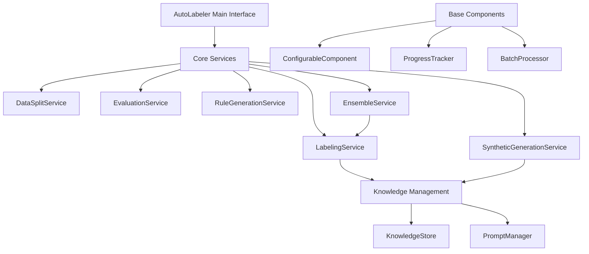

# AutoLabeler: Advanced AI-Powered Data Labeling System

[](https://www.python.org/downloads/)
[](https://opensource.org/licenses/MIT)

AutoLabeler is a sophisticated, modular data labeling system that leverages Large Language Models (LLMs) with Retrieval-Augmented Generation (RAG), ensemble learning, and synthetic data generation to automatically label text datasets with high accuracy and explainability.

## Table of Contents

- [Overview](#overview)
- [Key Features](#key-features)
- [Architecture](#architecture)
- [Installation](#installation)
- [Quick Start](#quick-start)
- [Configuration](#configuration)
- [Usage Guide](#usage-guide)
- [Core Services](#core-services)
- [API Reference](#api-reference)
- [CLI Usage](#cli-usage)
- [Examples](#examples)
- [Performance Tips](#performance-tips)
- [Migration Guide](#migration-guide)
- [Contributing](#contributing)

## Overview

AutoLabeler v2.0 features a completely refactored, modular architecture that maintains all the powerful functionality of v1 while providing:

- **Cleaner Code Organization**: Service-oriented architecture with single-responsibility components
- **Improved Maintainability**: Modular design makes it easy to extend and modify
- **Better Performance**: Optimized batch processing and async support throughout
- **Enhanced Flexibility**: Configuration-driven approach for all components
- **Reduced Complexity**: Simplified interfaces with sensible defaults

## Key Features

### 🎯 Core Capabilities
- **RAG-Enhanced Labeling**: Retrieves similar examples to provide context for accurate labeling
- **Multi-Model Ensemble**: Combine predictions from multiple LLMs for improved accuracy
- **Synthetic Data Generation**: Balance datasets by generating high-quality synthetic examples
- **Automatic Rule Generation**: Extract human-readable labeling rules from your data
- **Confidence Scoring**: Each prediction includes calibrated confidence scores
- **Incremental Learning**: Knowledge base grows and improves over time

### 🚀 Advanced Features (Phase 3)
- **Multi-Agent Architecture**: Specialized agents for different annotation tasks (NER, relations, sentiment) with intelligent routing
- **Drift Detection**: Production monitoring with PSI, KS tests, and embedding-based drift analysis
- **STAPLE Ensemble**: Weighted multi-annotator consensus using EM algorithm for improved accuracy
- **DPO/RLHF Alignment**: Task-specific model fine-tuning with Direct Preference Optimization
- **Constitutional AI**: Principled annotation consistency with automated violation detection and revision

### 🔧 Technical Features
- **Modular Architecture**: Clean separation of concerns with specialized services
- **Async Support**: Native async/await support for high-throughput applications
- **Batch Processing**: Efficient parallel processing with automatic progress tracking
- **Resume Capability**: Interrupt and resume long-running operations
- **Comprehensive Logging**: Detailed logging with loguru for debugging and monitoring
- **Type Safety**: Full type hints throughout the codebase

## Architecture

The new modular architecture consists of specialized services:



## Installation

### Prerequisites
- Python 3.10 or higher
- Virtual environment (recommended)

### Install from Source

```bash
# Clone the repository
git clone https://github.com/yourusername/autolabeler.git
cd autolabeler

# Create virtual environment
python -m venv venv
source venv/bin/activate  # On Windows: venv\Scripts\activate

# Install with pip
pip install -e .

# Or install with uv (faster)
uv pip install -e .
```

### Environment Setup

Create a `.env` file in the project root:

```env
# Required: Choose one LLM provider
OPENROUTER_API_KEY=your_openrouter_key
# OR
OPENAI_API_KEY=your_openai_key

# Optional: Corporate proxy settings
CORPORATE_BASE_URL=https://your-proxy.com/v1
CORPORATE_API_KEY=your_corporate_key

# Optional: Model settings
DEFAULT_MODEL=meta-llama/llama-3.1-8b-instruct:free
EMBEDDING_MODEL=sentence-transformers/all-MiniLM-L6-v2

# Optional: Logging
LOG_LEVEL=INFO
LOG_FORMAT="{time} | {level} | {message}"
```

## Quick Start

### Basic Usage

```python
from autolabeler import AutoLabeler, Settings
import pandas as pd

# Initialize with settings
settings = Settings()  # Reads from .env
labeler = AutoLabeler("sentiment_analysis", settings)

# Add training examples
train_df = pd.DataFrame({
    "text": ["This movie was fantastic!", "Terrible experience."],
    "label": ["positive", "negative"]
})
labeler.add_training_data(train_df, "text", "label")

# Label new data
new_df = pd.DataFrame({
    "text": ["Great product, highly recommend!", "Waste of money."]
})
results = labeler.label(new_df, "text")
print(results[["text", "predicted_label", "confidence"]])
```

### Using Individual Services

```python
from autolabeler.core import LabelingService, LabelingConfig

# Direct service usage for more control
config = LabelingConfig(
    use_rag=True,
    k_examples=5,
    confidence_threshold=0.8
)
service = LabelingService("my_dataset", config)

# Label single text
result = service.label_text("This is amazing!")
print(f"Label: {result['label']}, Confidence: {result['confidence']}")
```

## Configuration

### Configuration-Driven Approach

Each service accepts a configuration object:

```python
from autolabeler.core import (
    LabelingConfig,
    BatchConfig,
    EnsembleConfig,
    GenerationConfig
)

# Labeling configuration
labeling_config = LabelingConfig(
    use_rag=True,
    k_examples=5,
    prefer_human_examples=True,
    confidence_threshold=0.7,
    model_name="gpt-3.5-turbo",
    temperature=0.1
)

# Batch processing configuration
batch_config = BatchConfig(
    batch_size=100,
    max_concurrency=5,
    save_interval=50,
    resume=True
)

# Ensemble configuration
ensemble_config = EnsembleConfig(
    method="confidence_weighted",
    min_confidence=0.6,
    agreement_threshold=0.8
)
```

### JSON Configuration File

For complex projects, use a configuration file:

```json
{
  "project": {
    "name": "sentiment_classifier",
    "description": "Customer review sentiment analysis"
  },
  "labeling": {
      "model_name": "openai/gpt-4-turbo",
      "temperature": 0.1,
      "use_rag": true,
    "k_examples": 5,
    "confidence_threshold": 0.8
    },
  "batch": {
    "batch_size": 100,
    "max_concurrency": 5,
    "save_interval": 50
  },
  "ensemble": {
    "models": [
      {"model_name": "gpt-4", "temperature": 0.1},
      {"model_name": "claude-3", "temperature": 0.2},
      {"model_name": "llama-3-70b", "temperature": 0.3}
    ],
    "method": "weighted_vote"
  }
}
```

## Usage Guide

### Complete Workflow Example

   ```python
   from autolabeler import AutoLabeler, Settings
import pandas as pd

# 1. Initialize
settings = Settings()
labeler = AutoLabeler("product_reviews", settings)

# 2. Load and prepare data
df = pd.read_csv("reviews.csv")

# 3. Create train/test split
train_df, test_df = labeler.split_data(
    df, test_size=0.2, stratify_column="category"
)

# 4. Add training data
   labeler.add_training_data(
       train_df,
    text_column="review_text",
    label_column="sentiment"
)

# 5. Generate labeling rules
rules = labeler.generate_rules(
    description="Classify product reviews as positive, negative, or neutral"
)
print(f"Generated {len(rules)} labeling rules")

# 6. Label unlabeled data with ensemble
results = labeler.label_ensemble(
    test_df,
    text_column="review_text",
    models=["gpt-3.5-turbo", "claude-2", "llama-2-70b"],
    method="confidence_weighted"
)

# 7. Evaluate performance
metrics = labeler.evaluate(
    results,
    true_label_column="sentiment",
    predicted_label_column="ensemble_label"
)
print(f"Accuracy: {metrics['accuracy']:.2%}")
print(f"F1 Score: {metrics['f1_weighted']:.2%}")

# 8. Generate synthetic data to balance dataset
synthetic_data = labeler.generate_synthetic_data(
    target_distribution={"positive": 1000, "negative": 1000, "neutral": 1000},
    strategy="mixed"
)

# 9. Export results
labeler.export_results("results/product_reviews_labeled.csv")
   ```

## Core Services

### LabelingService
Handles all labeling operations with RAG support.

   ```python
from autolabeler.core import LabelingService, LabelingConfig

config = LabelingConfig(use_rag=True, k_examples=5)
service = LabelingService("my_dataset", config)

   # Single text
result = service.label_text("Great product!")

# Batch labeling
results = service.label_batch(texts, batch_size=100)
```

### DataSplitService
Manages train/test/validation splits with leakage prevention.

```python
from autolabeler.core import DataSplitService

service = DataSplitService("my_dataset")
train_df, test_df, val_df = service.split_data(
    df, test_size=0.2, val_size=0.1, stratify_column="label"
   )
   ```

### EvaluationService
Comprehensive evaluation with multiple metrics.

   ```python
from autolabeler.core import EvaluationService

service = EvaluationService("my_dataset")
results = service.evaluate_predictions(
    y_true, y_pred, confidence_scores=confidences
)
service.create_report(results, "evaluation_report.html")
   ```

### SyntheticGenerationService
Generates synthetic examples to balance datasets.

```python
from autolabeler.core import SyntheticGenerationService, GenerationConfig

config = GenerationConfig(strategy="diversity_focused", num_examples=100)
service = SyntheticGenerationService("my_dataset", config)

synthetic_df = service.generate_for_label(
    "rare_class", num_examples=50
)
```

### RuleGenerationService
Extracts human-readable labeling rules.

```python
from autolabeler.core import RuleGenerationService

service = RuleGenerationService("my_dataset")
rules = service.generate_rules(labeled_df, "text", "label")
service.export_rules("labeling_guidelines.md", format="markdown")
```

### EnsembleService
Manages multi-model ensemble predictions.

```python
from autolabeler.core import EnsembleService, ModelConfig

service = EnsembleService("my_dataset")

# Add model variants
service.create_model_variants(
    "gpt-3.5-turbo",
    temperatures=[0.1, 0.5, 0.9]
)

# Get ensemble predictions
result = service.label_text_ensemble(
    "This is great!",
    method="confidence_weighted"
)
```

## API Reference

### Main Interface

```python
class AutoLabeler:
    def __init__(self, dataset_name: str, settings: Settings)

    def add_training_data(self, df: DataFrame, text_column: str, label_column: str)

    def label(self, df: DataFrame, text_column: str) -> DataFrame

    def label_ensemble(self, df: DataFrame, text_column: str, models: list[str]) -> DataFrame

    def generate_synthetic_data(self, target_distribution: dict[str, int]) -> DataFrame

    def generate_rules(self, description: str) -> list[dict]

    def evaluate(self, df: DataFrame, true_column: str, pred_column: str) -> dict

    def split_data(self, df: DataFrame, test_size: float) -> tuple[DataFrame, DataFrame]
```

### Configuration Classes

All configuration uses Pydantic models with validation:

```python
LabelingConfig      # Configure labeling behavior
BatchConfig         # Configure batch processing
EnsembleConfig      # Configure ensemble methods
GenerationConfig    # Configure synthetic generation
EvaluationConfig    # Configure evaluation
RuleGenerationConfig # Configure rule generation
```

## CLI Usage

### Basic Commands

```bash
# Label a dataset
autolabeler label \
    --dataset my_dataset \
    --input data.csv \
    --text-column text \
    --output labeled.csv

# Generate synthetic data
autolabeler generate \
    --dataset my_dataset \
    --strategy balanced \
    --num-per-class 100 \
    --output synthetic.csv

# Evaluate predictions
autolabeler evaluate \
    --dataset my_dataset \
    --predictions predictions.csv \
    --true-labels true_labels.csv \
    --report evaluation_report.html

# Generate labeling rules
autolabeler rules \
    --dataset my_dataset \
    --labeled-data labeled.csv \
    --output rules.md
```

### Advanced CLI Usage

```bash
# Ensemble labeling with multiple models
autolabeler ensemble \
    --dataset my_dataset \
    --input unlabeled.csv \
    --models gpt-4,claude-3,llama-3 \
    --method confidence_weighted \
    --output ensemble_results.csv

# Run a complete pipeline from a config file
autolabeler run --config pipeline_config.json
```

### Pipeline Configuration

The `run` command uses a JSON file to orchestrate a series of tasks. This allows you to define a complete data processing workflow in a single file.

**`pipeline_config.json` Example:**

```json
{
  "project_name": "sentiment_analysis_pipeline",
  "tasks": [
    {
      "type": "label",
      "params": {
        "dataset_name": "sentiment_analysis",
        "input_file": "data/raw_reviews.csv",
        "output_file": "results/labeled_reviews.csv",
        "text_column": "review_text",
        "train_file": "data/training_examples.csv",
        "label_column": "sentiment"
      }
    },
    {
      "type": "evaluate",
      "params": {
        "dataset_name": "sentiment_analysis",
        "predictions_file": "results/labeled_reviews.csv",
        "true_label_column": "ground_truth_sentiment",
        "pred_label_column": "predicted_label",
        "report_file": "results/evaluation_report.html"
      }
    },
    {
      "type": "rules",
      "params": {
        "dataset_name": "sentiment_analysis",
        "labeled_file": "data/training_examples.csv",
        "text_column": "review_text",
        "label_column": "sentiment",
        "output_file": "results/guidelines.md",
        "task_description": "Classify review sentiment as positive, negative, or neutral."
      }
    }
  ]
}
```

## Examples

### Example 1: Customer Support Ticket Classification

```python
from autolabeler import AutoLabeler, Settings

# Initialize
settings = Settings(llm_model="gpt-4", temperature=0.1)
labeler = AutoLabeler("support_tickets", settings)

# Define categories
categories = ["billing", "technical", "feature_request", "complaint"]

# Add examples for each category
for category in categories:
    examples_df = pd.read_csv(f"examples/{category}.csv")
    labeler.add_training_data(examples_df, "ticket_text", "category")

# Label new tickets with ensemble
new_tickets = pd.read_csv("new_tickets.csv")
results = labeler.label_ensemble(
    new_tickets,
    "ticket_text",
    models=["gpt-4", "claude-3"],
    method="high_agreement"
)

# Generate rules for support team
rules = labeler.generate_rules(
    "Classify support tickets into billing, technical, feature requests, or complaints"
)
labeler.export_rules("support_ticket_guidelines.md")
```

### Example 2: Multi-Label Document Classification

```python
# Custom configuration for multi-label
from autolabeler.core import LabelingService, LabelingConfig

config = LabelingConfig(
    use_rag=True,
    k_examples=10,  # More examples for complex task
    confidence_threshold=0.6,  # Lower threshold for multi-label
    metadata_columns=["document_type", "source", "date"]
)

service = LabelingService("document_tagger", config)

# Process documents
for doc in documents:
    result = service.label_text(
        doc["content"],
        metadata={
            "document_type": doc["type"],
            "source": doc["source"]
        }
    )

    # Multi-label handling
    labels = result["label"].split(",")
    confidences = result["confidence_per_label"]
```

### Example 3: Production Pipeline with Monitoring

```python
from autolabeler import AutoLabeler
from autolabeler.core import EvaluationService
import asyncio
from datetime import datetime

class ProductionLabeler:
    def __init__(self, dataset_name: str):
        self.labeler = AutoLabeler(dataset_name, Settings())
        self.evaluator = EvaluationService(dataset_name)

    async def process_batch(self, batch_df: pd.DataFrame):
        """Process a batch with monitoring."""
        start_time = datetime.now()

        # Label with ensemble
        results = await self.labeler.label_ensemble_async(
            batch_df,
            "text",
            models=["gpt-3.5-turbo", "claude-instant"],
            method="confidence_weighted"
        )

        # Monitor confidence distribution
        low_confidence = results[results["confidence"] < 0.7]
        if len(low_confidence) > 0.1 * len(results):
            logger.warning(f"High proportion of low confidence predictions: {len(low_confidence)}/{len(results)}")

        # Track performance
        elapsed = (datetime.now() - start_time).total_seconds()
        logger.info(f"Processed {len(batch_df)} items in {elapsed:.2f}s")

        return results

# Run production pipeline
async def main():
    labeler = ProductionLabeler("production_dataset")

    # Process streaming data
    async for batch in data_stream:
        results = await labeler.process_batch(batch)
        await save_results(results)

asyncio.run(main())
```

## Performance Tips

### 1. Optimize Service Configuration
```python
# For high throughput
config = LabelingConfig(
    use_rag=False,  # Disable RAG if not needed
    confidence_threshold=0.0,  # Don't update knowledge base
    temperature=0.0  # Deterministic outputs
)

# For high accuracy
config = LabelingConfig(
    use_rag=True,
    k_examples=10,
    prefer_human_examples=True,
    temperature=0.1
)
```

### 2. Use Batch Processing
```python
# Good: Process in batches
results = labeler.label(df, "text", batch_size=100)

# Better: Use async for maximum throughput
results = await labeler.label_async(df, "text", batch_size=200)
```

### 3. Enable Progress Tracking
```python
# Monitor long-running operations
labeler.enable_progress_tracking()
results = labeler.label(large_df, "text", save_interval=100)
```

### 4. Optimize Ensemble Usage
```python
# Use fewer models for speed
fast_ensemble = labeler.label_ensemble(df, "text", models=["gpt-3.5-turbo"])

# Use more models for accuracy
accurate_ensemble = labeler.label_ensemble(
    df, "text",
    models=["gpt-4", "claude-3", "llama-3-70b"],
    method="high_agreement"
)
```

## Migration Guide

### Migrating from v1 to v2

The new modular architecture maintains backward compatibility while offering cleaner interfaces:

```python
# Old way (v1)
from autolabeler import AutoLabeler
labeler = AutoLabeler(dataset_name, settings)
results = labeler.label_dataframe(df, "text", use_rag=True, k=5)

# New way (v2) - Works the same!
from autolabeler import AutoLabeler
labeler = AutoLabeler(dataset_name, settings)
results = labeler.label(df, "text")  # Simplified method name

# Or use services directly for more control
from autolabeler.core import LabelingService, LabelingConfig
config = LabelingConfig(use_rag=True, k_examples=5)
service = LabelingService(dataset_name, config)
results = service.label_dataframe(df, "text")
```

### Key Changes

1. **Simplified method names**: `label_dataframe` → `label`
2. **Configuration objects**: Replace long parameter lists with config objects
3. **Service-oriented**: Each major function has its own service
4. **Async by default**: All services support async operations
5. **Better type hints**: Full typing support throughout

## Troubleshooting

### Common Issues

1. **Import Errors**
   ```python
   # Make sure to install in editable mode
   pip install -e .
   ```

2. **API Key Issues**
   ```bash
   # Check your .env file
   cat .env | grep API_KEY
   ```

3. **Memory Issues with Large Datasets**
   ```python
   # Process in smaller chunks
   for chunk in pd.read_csv("large_file.csv", chunksize=1000):
       results = labeler.label(chunk, "text")
       results.to_csv("output.csv", mode='a')
   ```

4. **Slow Performance**
   ```python
   # Disable unnecessary features
   config = LabelingConfig(
       use_rag=False,
       save_to_knowledge_base=False
   )
   ```

## Contributing

We welcome contributions! Please see [CONTRIBUTING.md](CONTRIBUTING.md) for guidelines.

### Development Setup

```bash
# Install development dependencies
pip install -e ".[dev]"

# Run tests
pytest tests/

# Format code
black src/
isort src/

# Type checking
mypy src/
```

## License

This project is licensed under the MIT License - see [LICENSE](LICENSE) for details.

## Citation

If you use AutoLabeler in your research, please cite:

```bibtex
@software{autolabeler2024,
  title = {AutoLabeler: Advanced AI-Powered Data Labeling System},
  version = {2.0.0},
  year = {2024},
  url = {https://github.com/yourusername/autolabeler}
}
```

## Acknowledgments

- Built with [LangChain](https://github.com/langchain-ai/langchain)
- Vector storage by [ChromaDB](https://www.trychroma.com/) and [FAISS](https://github.com/facebookresearch/faiss)
- LLM access via [OpenRouter](https://openrouter.ai/) and [OpenAI](https://openai.com/)

---

For more information, visit our [documentation](https://autolabeler.readthedocs.io/) or join our [Discord community](https://discord.gg/autolabeler).

